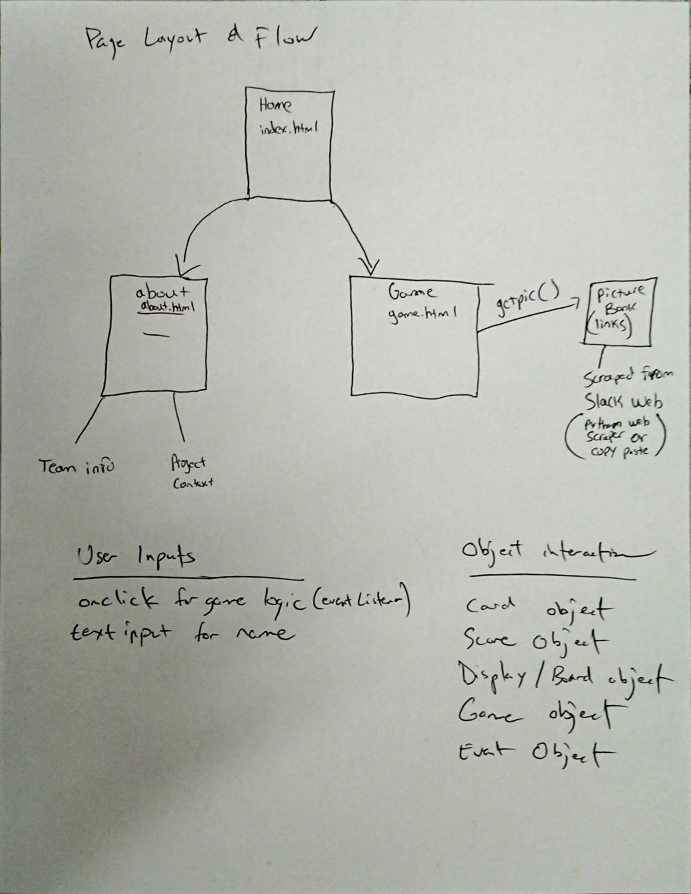
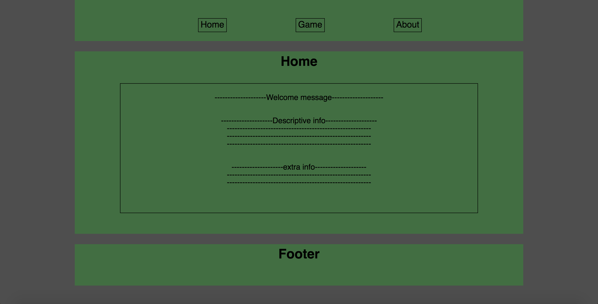
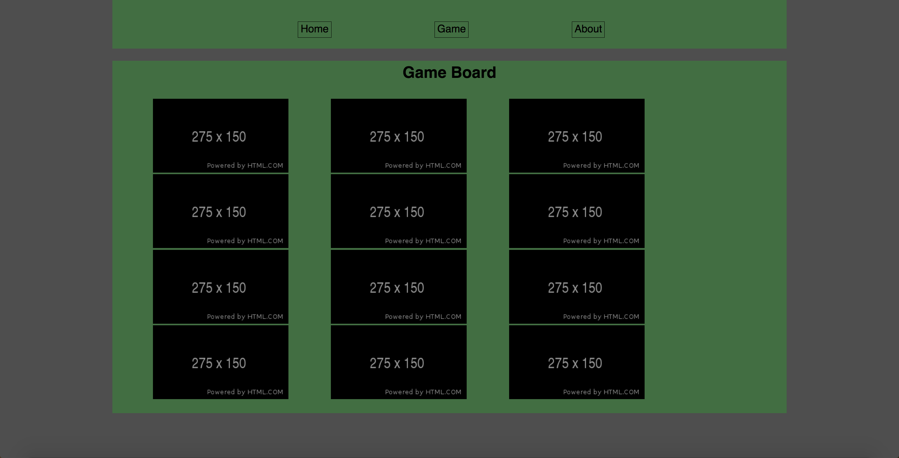
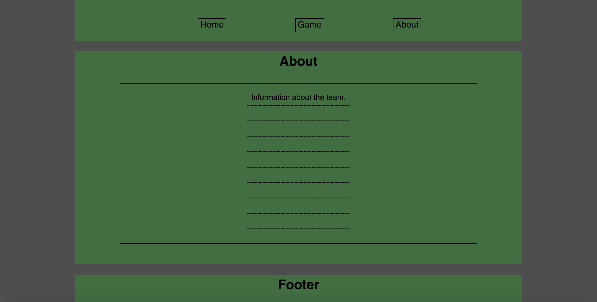

# 201d56Project

## Introduction

  This project is a memory guessing game to demonstrate JavaScript's functionality in handling
  Randomization, comparison and DOM manipulation logic for HTML. Additionally, it's purpose is
  to allow class members of 201d56 at Code Fellows to gain more familiarization with other class
  members by incorporating their images and names into this game.

## Description

  The game will initially render a 2D grid of a number of "faced-down" images arranged in a square
  pattern. A User will click on two images, which will reveal the image. If the images match, it will
  stay permanently faced-up. If not, the images will flipped back down. Users must correctly match
  all of the images to complete the game.

## Version History

## Contributors

- Matt Burger
- Stephen Chu
- Vinh Nguyen

## Tools

- VSCODE for Code Editing
- Slack for communication
- Git/Github for Version Control
- Javascript/HTML/CSS 

## Setup Instructions
__Step 1:__ To work on this codebase locally, use one of the following:
* Git ssh from command line: `$ git clone git@github.com:nguyenvinh2/201d56Project.git`
* Git http from command line: `$ git clone https://github.com/nguyenvinh2/201d56Project.git`
* Download zip [here](https://github.com/nguyenvinh2/201d56Project/archive/master.zip) and then unzip into your work directory.

__Step 2:__ Change directory into the local copy/repo: `$ cd 201d56Project`

__Step 3:__ Use you favorite code editor, ide, or text editor to open the files.

## Workflow

### User Stories
As a user, I want a game that requires the use of memory.

As a user, I want a game that will help me get to know my classmates more.

As a user, I want a game that only requires me to click and only have to enter my name.

As a user, I want to know how others did on the game so I know how I compare.

As a user, I want a game that will tell me my score at the end.

As a user, I want a game that describes the rules on a different page so I can view it first.

As a developer, I want to use DOMs to imitate cards that will be used to create a memory card game.

As a developer, I want the cards to have pictures of classmates on the back so to make the game relatable.

As a developer, I want the game to display information about the user's classmate if a match is made so that the user can learn a little about their fellow classmates.

As a developer, I want to demonstrate use of localStorage by saving user scores after page close.

As a developer, I want to make my javascript cleaner by using objects and arrays. 

As a developer, I want to store my code uniformily into multiple js files to make my code more readable.

### MVP
Minimum Viable Product will consist of the following:
* Complete HTML pages
    * Landing/Home page
    * Game page/Game board
    * About Us page
* Landing/Home Page
    * Provide clear instructions for the player
* About us page
    * Display information about the dev team
* Consistent CSS theme for each page
* Animate card flipping in CSS
* All necessary images downloaded/hotlinked
* Javascript logic working for the game page
    * Randomize cards
    * Render table
    * Detect mouse clicks
    * Compares two select option
    * Resets if option select does not match, advances if matches
    * Continues until game finishes
* Allow saving of each completed game score in to local storage
* Keep track if first card flipped vs second card flipped
* Present score (number of wrong guesses) at the end
* Allow the player to enter their name at end of game
* Allow saving of each completed game score to local storage

### Stretch Goals
* Animate successful match animation/flair
* Animate failure match animation/flair
* Add difficulty setting
* Allow saving of an incomplete game
* Add option to play again upon completion
* Modal pop-up if revealed game card is clicked on
* Allow uploading of new cards

### Page and Logic Flow

### Wire Frame

Subject to change:

## Group Work Agreement

### Work Plan

    - The project repository will reside on Github.
    - Team members will meet in person from 9AM-6PM to develop the project for its duration.
    - The team will follow initial planning that was agreed upon. 
    - The team will have a daily standup first thing in the morning. The daily standup will 
      set the daily goals and tasks for the day depending on progress.
    - Each member during stand up will also have a chance to address any concerns and to 
      gauge the progress being made by each team member.
    - Each member will understand their task for the day prior to completion of stand-up.
    - Updates to the project will be completed via the Git Plan.
    - Before leaving, the group will get together and evaluate the progress for the day and 
      identify signs of potential problems for correction during next morning's stand up.

### Conflict Plan

    When faced with conflict, members involved in the conflict should first try to amicable 
    resolve the problem between them. Upon failure of a resolution, the entire group will 
    discuss the issue beforehand in order to make a decision. If a solution cannot be reached 
    unanimously, then a majority vote is required to proceed forward. All team members will 
    agree to the commit to the decision made by the group.

    Members who appear to have inadequately contribute to the group shall be assessed by 
    themselves as well as the group the area where they can make the most contribution. If lack 
    of contribution is due to willful poor effort rather than technical capabilities, then it 
    should be reported.

### Communication Plan

    - Our team plans to use Slack and Chime as well as in person for all communication on project 
      planning and version control.
    - Our team plans to approach decision making in a transparent and open manner.
    - Morning stand-ups and end of day check-in in the normal work plan can also be used for 
      discussing any issues.

### Git Process

    - After initial scaffolding of the master branch, restrictions will be placed on the master 
      branch to prevent single user merging.
    - Atleast two review approvals is require to merge to master.
    - Each person work on their own branch. The branch owner is encouraged to experiment this 
      branch, including pulling from other user’s branch.
    - On intermittent periods during the working day, the group will to execute a merging process. 
      Everyone will give status reports on the progress of their work and propose merging the master 
      branch via a Pull Request. The author of the branch should verify the target branch is functional 
      prior a PR.
    - Once merged, all users will update their own local branch with the updated repository. 
    - The last person to give approval during the review process shall merge into master.
    - Ideally, the merging process would coincide at the beginning and end of the day status report. 
      This will allow an orderly merging process and allow users to work on their own branch. 
      If a completed feature is needed to be incorporated sometime in the middle of the workday,
      then the normal process shall be followed.
    - An ad-hoc review meeting can be initiated by any member for merging into master.

